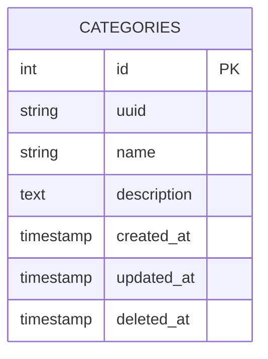
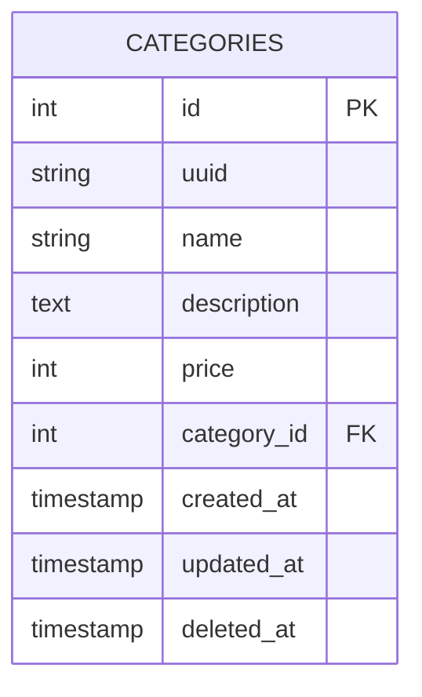

[](https://classroom.github.com/a/VBKEg2O7)
# Sistema de Gerenciamento de Peças de Computadores (CRUD com FastAPI)

Este projeto tem como objetivo criar uma API REST para gerenciar peças de computadores, categorizadas em diferentes tipos, como "Placas-mãe", "Memórias RAM", etc. O projeto usa FastAPI para a API, PostgreSQL como banco de dados e Docker para gerenciar os serviços.

## Ferramentas Utilizadas

FastAPI: Framework web rápido e moderno para construção de APIs com Python.
SQLAlchemy: ORM para interação com o banco de dados.
PostgreSQL: Sistema de banco de dados relacional.
Docker & Docker Compose: Para configurar e orquestrar o ambiente de desenvolvimento.

## Estrutura do Projeto

```cli
project/
├── app/
│   ├── __init__.py
│   ├── main.py
│   ├── models.py
│   ├── crud.py
│   ├── schemas.py
│   ├── database.py
│   └── alembic.ini (migrations config)
├── docker-compose.yml
├── Dockerfile
└── requirements.txt
```

## Como Rodar o Projeto

### 1. Preparação do Ambiente

- [ ] Certifique-se de ter o Docker e o Docker Compose instalados na sua máquina.

### 2. Clonar o Repositório

- [ ] Clone este repositório:

```bash
git clone <SEU_REPOSITORIO>
cd project
```

### 3. Configurar e subir o ambiente com Docker Compose

- [ ] Execute o seguinte comando para montar o ambiente de desenvolvimento com Docker Compose:

```bash
docker-compose up --build
```

Isso irá:

- Criar um contêiner para a aplicação FastAPI.
- Criar um contêiner para o banco de dados PostgreSQL.

### 4. Testar a API

- [ ] Após a execução do docker-compose, a API estará disponível em <http://localhost:8000>. Para testar e interagir com a API, acesse a documentação interativa:

```bash
http://localhost:8000/docs
```

### 5. Criar Categoria

Implementar o CRUD de categoria, use a seguinte tabela como modelo:



#### a. Criar categoria

- [ ] Implemente a rota `POST /categories/` que deve criar uma nova categoria de peças. Exemplo de dado:

```json
{
  "name": "Processadores",
  "description": "Peças de CPU"
}
```

Response:

201 - CREATED

```json
{
    "uuid": "503b42f4-dcfd-45c1-9e7f-4e93901016b2",
    "name": "Processadores",
    "description": "Peças de CPU"
}
```

#### b. Listar categorias

- [ ] Implemente a rota `GET /categories/` que deve retornar uma lista de categorias, exemplo:

**200 - OK**

```json
[
    {
        "uuid": "503b42f4-dcfd-45c1-9e7f-4e93901016b2",
        "name": "Processadores",
        "description": "Peças de CPU"
    },
    {
        "uuid": "db96ffd1-af32-4166-9169-bc57e32ed992",
        "name": "Memórias",
        "description": ""
    },
    {
        "uuid": "47f8cb39-db9b-49d6-b82e-582d7ccc8d45",
        "name": "Armazenamento",
        "description": "Peças de CPU"
    },
]
```

ou retornar uma lista vazia, caso não tenha categorias cadastradas ainda.

#### c. Listar uma categoria

- [ ] Implemente a rota `GET /categories/<uuid>` que deve retornar uma categoria. Exemplo de retorno:

**200 - OK**

```json
{
  "name": "Processadores",
  "description": "Peças de CPU"
}
```

**404 - NOT FOUND**

#### d. Editar uma categoria

- [ ] Implemente a rota `PUT|PATCH /categories/<uuid>` que deve alterar uma categoria. O payload é:

```json
{
  "name": "Processadores Intel",
  "description": "Peças de CPU"
}
```

Response:

**200 - OK**

```json
{
  "name": "Processadores Intel",
  "description": "Peças de CPU"
}
```

**404 - NOT FOUND**

#### e. Remover uma categoria

- [ ] Implemente a rota `DELETE /categories/<uuid>` que deve remover uma categoria.

Response:

**200 - OK**

ou

**404 - NOT FOUND**

### 6. Itens

Implemente as mesmas rotas que foram implementadas no item anterior ([5. Criar Categoria](#5-criar-categoria)) para a entidade `Item`. Siga o seguinte modelo:



Rotas do CRUD:

- [ ] `GET /items/`
- [ ] `GET /items/<uuid>`
- [ ] `POST /items/`
- [ ] `PUT|PATCH /items/<uuid>`
- [ ] `DELETE /items/<uuid>`

Exemplo de payload:

```json
{
  "name": "Intel Core i9",
  "description": "Processador Intel de última geração",
  "price": 3000,
  "category_id": 1
}
```

### Bônus

- [ ] Implemente a seguinte rota: `GET /categories/<uuid>/items` que deve retornar todos os items relacionados a determinada categoria.
- [ ] Adicionar autenticação JWT para proteger as rotas de criação e deleção.

## Dúvidas

Se você tiver alguma dúvida sobre a execução do projeto ou qualquer outro ponto, sinta-se à vontade para perguntar!
